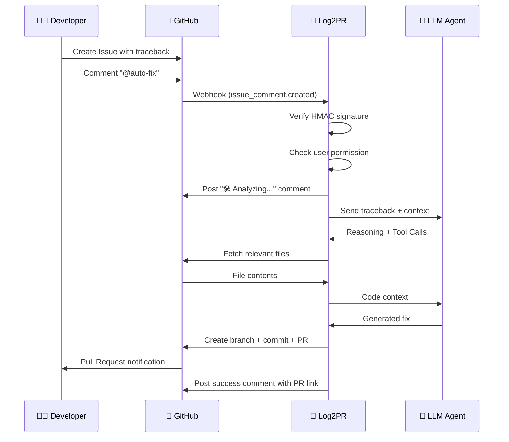
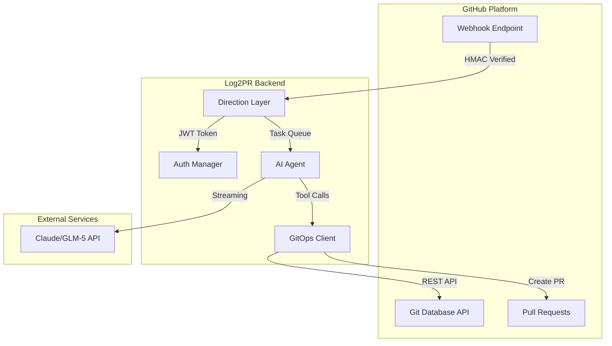
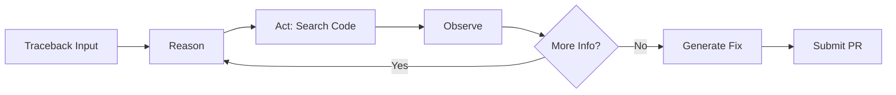

# 🚀 Log2PR

[](https://www.python.org/)
[](https://fastapi.tiangolo.com/)
[](https://www.anthropic.com/)
[](https://opensource.org/licenses/MIT)

**From Traceback to Pull Request in Seconds. No Clones, Pure API Magic.**

> 🎯 Turn your error logs into production-ready fixes automatically.
> Zero local Git operations. 100% Serverless-ready. Powered by LLM.

---

## ✨ Introduction

**Log2PR** is a GitHub App that automatically analyzes traceback errors from Issues and generates fix Pull Requests using AI. When a developer posts `@auto-fix` in an issue comment, Log2PR springs into action:

1. 🔍 **Analyzes** the traceback to identify the root cause
2. 🧠 **Reasons** through the codebase using LLM-powered intelligence
3. 🔧 **Generates** a fix with proper context and understanding
4. 📤 **Submits** a clean Pull Request without ever cloning the repo

### 🏆 Key Selling Points

| Feature | Description |
|---------|-------------|
| 🪄 **Zero Local Clone Architecture** | All Git operations via GitHub REST API in memory. No `git clone`, no disk I/O, pure HTTP magic |
| 🧠 **LLM-Powered Analysis** | Uses Claude/GLM-5 with ReAct reasoning loop for intelligent bug diagnosis |
| 💭 **Real-time Thinking Stream** | Watch the AI think through problems step-by-step with transparent reasoning |
| ☁️ **Serverless-Ready Design** | Stateless architecture perfect for AWS Lambda, Cloudflare Workers, or any FaaS platform |

---

## 🔄 Workflow



---

## 🏗️ Architecture



### Core Components

| Component | File | Description |
|-----------|------|-------------|
| 🎯 **Webhook Router** | `app/routers/webhook.py` | Handles incoming GitHub webhooks with signature verification |
| 🔐 **Auth Manager** | `app/services/github_auth.py` | GitHub App JWT generation & token caching |
| 🤖 **AI Agent** | `app/services/agent_service.py` | ReAct loop with tool calling for intelligent fixes |
| 📦 **GitOps Client** | `app/services/github_client.py` | Memory-based Git operations via REST API |

---

## 🚀 Getting Started

### Prerequisites

- Python 3.11+
- GitHub App credentials (App ID + Private Key)
- LLM API access (Claude/GLM-5)

### Quick Start

```bash
# Clone the repository
git clone https://github.com/your-org/log2pr.git
cd log2pr

# Install dependencies with Poetry
poetry install

# Activate virtual environment
poetry shell

# Copy environment template
cp .env.example .env
# Edit .env with your credentials

# Run the server
poetry run uvicorn app.main:app --reload
```

---

## 📦 Installation

### Docker (Recommended)

```bash
# Build the image
docker build -t log2pr:latest .

# Run the container
docker run -d \
  --name log2pr \
  -p 8000:8000 \
  --env-file .env \
  log2pr:latest
```

### Poetry (Recommended for Development)

```bash
# Install Poetry (if not installed)
curl -sSL https://install.python-poetry.org | python3 -

# Install dependencies
poetry install

# Install with dev dependencies
poetry install --with dev

# Run the application
poetry run uvicorn app.main:app --reload
```

---

## ⚙️ Configuration

Create a `.env` file in the project root:

```bash
# GitHub App Configuration
GITHUB_APP_ID=your_app_id_here
GITHUB_WEBHOOK_SECRET=your_webhook_secret
GITHUB_PRIVATE_KEY_PATH=/path/to/private-key.pem

# LLM Configuration
ANTHROPIC_AUTH_TOKEN=your_api_token
ANTHROPIC_BASE_URL=https://api.anthropic.com  # or your provider

# Optional
DEBUG=false
LOG_LEVEL=INFO
```

### GitHub App Setup

1. **Create GitHub App** at https://github.com/settings/apps
2. **Configure Permissions**:
   - Contents: Read & Write
   - Issues: Read & Write
   - Pull Requests: Read & Write
3. **Generate Private Key** and save as `.pem` file
4. **Set Webhook URL** (use ngrok/smee for local development)
5. **Install App** on your repositories

### Environment Variables

| Variable | Required | Description |
|----------|----------|-------------|
| `GITHUB_APP_ID` | ✅ | GitHub App ID from settings |
| `GITHUB_WEBHOOK_SECRET` | ✅ | Secret for webhook signature verification |
| `GITHUB_PRIVATE_KEY_PATH` | ✅ | Path to `.pem` private key file |
| `ANTHROPIC_AUTH_TOKEN` | ✅ | LLM API authentication token |
| `ANTHROPIC_BASE_URL` | ✅ | LLM API endpoint URL |
| `DEBUG` | ❌ | Enable debug mode (default: `false`) |
| `LOG_LEVEL` | ❌ | Logging level (default: `INFO`) |

---

## 🛠️ Features in Detail

### 🔐 Security-First Design

- **HMAC Signature Verification**: Every webhook request is cryptographically verified
- **Permission-Based Access Control**: Only `OWNER`, `COLLABORATOR`, and `MEMBER` can trigger auto-fix
- **JWT Token Caching**: Reduces API calls with intelligent token lifecycle management

### 🧠 Intelligent Analysis

The AI agent uses a **ReAct (Reasoning + Acting)** loop:



### 🔧 Available Tools

| Tool | Description |
|------|-------------|
| `search_code` | Search for files using GitHub Code Search API |
| `get_file_content` | Retrieve file contents at specific path |
| `submit_fix` | Submit the generated fix as a Pull Request |

### 📊 Retry Mechanism

Built-in resilience with exponential backoff:

```python
# 5 retries with linear incremental delay
# Attempt 1: immediate
# Attempt 2: wait 1s
# Attempt 3: wait 2s
# Attempt 4: wait 3s
# Attempt 5: wait 4s
```

---

## 📝 Usage

### Trigger Auto-Fix

Simply comment `@auto-fix` on any Issue containing a traceback:

```markdown
## Error Report

```
Traceback (most recent call last):
  File "app/services/user.py", line 42, in get_user
    return user["name"]
KeyError: 'name'
```

@auto-fix please help!
```

### Response Flow

1. **Acknowledged**: Bot posts "🛠️ log2pr 已接管，正在分析报错日志并读取源码..."
2. **Processing**: AI analyzes the traceback and searches for related code
3. **Completed**: Bot posts PR link with summary of changes

---

## 📁 Project Structure

```
log2pr/
├── app/
│   ├── __init__.py
│   ├── main.py              # FastAPI app factory
│   ├── config.py            # Settings & configuration
│   ├── prompts.py           # System prompts & tool definitions
│   ├── exceptions.py        # Custom exception classes
│   ├── models/
│   │   └── webhook.py       # Pydantic models for webhooks
│   ├── routers/
│   │   └── webhook.py       # Webhook endpoint handler
│   └── services/
│       ├── github_auth.py   # JWT auth & token management
│       ├── github_client.py # GitOps client (memory-based)
│       └── agent_service.py # AI agent with ReAct loop
├── tests/
│   ├── test_webhook.py      # Webhook tests
│   └── test_auth.py         # Auth tests
├── Dockerfile
├── requirements.txt
└── README.md
```

---

## 🤝 Contributing

Contributions are welcome! Please feel free to submit a Pull Request.

1. Fork the repository
2. Create your feature branch (`git checkout -b feature/amazing-feature`)
3. Commit your changes (`git commit -m 'Add amazing feature'`)
4. Push to the branch (`git push origin feature/amazing-feature`)
5. Open a Pull Request

---

## 📄 License

This project is licensed under the **MIT License** - see the [LICENSE](LICENSE) file for details.

```
MIT License

Copyright (c) 2024 Log2PR Contributors

Permission is hereby granted, free of charge, to any person obtaining a copy
of this software and associated documentation files (the "Software"), to deal
in the Software without restriction, including without limitation the rights
to use, copy, modify, merge, publish, distribute, sublicense, and/or sell
copies of the Software, and to permit persons to whom the Software is
furnished to do so, subject to the following conditions:

The above copyright notice and this permission notice shall be included in all
copies or substantial portions of the Software.

THE SOFTWARE IS PROVIDED "AS IS", WITHOUT WARRANTY OF ANY KIND, EXPRESS OR
IMPLIED, INCLUDING BUT NOT LIMITED TO THE WARRANTIES OF MERCHANTABILITY,
FITNESS FOR A PARTICULAR PURPOSE AND NONINFRINGEMENT. IN NO EVENT SHALL THE
AUTHORS OR COPYRIGHT HOLDERS BE LIABLE FOR ANY CLAIM, DAMAGES OR OTHER
LIABILITY, WHETHER IN AN ACTION OF CONTRACT, TORT OR OTHERWISE, ARISING FROM,
OUT OF OR IN CONNECTION WITH THE SOFTWARE OR THE USE OR OTHER DEALINGS IN THE
SOFTWARE.
```

---

<p align="center">
  <strong>Made with ❤️ by the Log2PR Team</strong>
</p>

<p align="center">
  <a href="https://github.com/your-org/log2pr/issues">Report Bug</a> •
  <a href="https://github.com/your-org/log2pr/issues">Request Feature</a>
</p>
